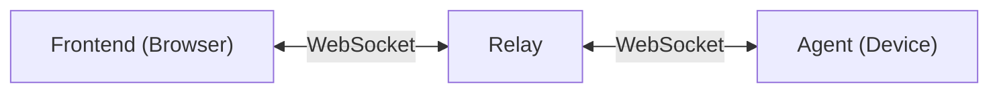

# Webterm

> [!CAUTION]
>
> **🐉 Here be dragons!**
>
> This project is in early development phase and not intended for production use yet. Features are incomplete and may
> undergo significant changes. Please treat this as experimental and expect nothing to work.


**Webterm** (short for "web terminal") is a lightweight and efficient tool for providing secure, browser-based access to
remote terminals. It is designed for environments where devices, servers, or containers cannot be accessed directly over
the public network — such as those behind firewalls, on private networks, or with blocked inbound ports. It is also
suitable for devices with dynamic or temporary IP addresses where traditional SSH access is either not feasible or not
desirable.

## Features

Written in Rust, Webterm is built from the ground up for security, performance, and extensibility.

- 🪶 **Extremely Lightweight**: Uses less than 10 MB of memory when idle.
- 🌍 **Works Anywhere**: Operates behind firewalls and NATs without open inbound ports.
- 🌐 **Browser-Based Terminal**: Access terminals securely via your web browser.
- 🔒 **Secure by Design**: Uses end-to-end encryption and a stateless relay that only passes encrypted data through.
- ⚡ **Optimised Communication**: Utilises [FlatBuffers](https://en.wikipedia.org/wiki/FlatBuffers) for high-performance,
  efficient data transmission.
- 🔄 **Persistent Sessions**: Leave a session open and reconnect days or weeks later, even if the server's IP address
  changes.
- 📟 **Multiple Terminals**: Open multiple terminals on the same device in a single session.

## Use Cases

* **Remote Access**: Connect to servers and devices securely using a browser.
* **Containers**: Manage Docker or Kubernetes instances without opening network ports.
* **Embedded & IoT**: Run on Raspberry Pi and other Linux-based low-power systems.
* **Personal Devices**: Enable secure remote access to your home server or laptop.

## Quickstart

1. Install Webterm agent using Cargo:
   ```bash
   cargo install webterm-agent
   ```

2. Start the Webterm agent:
   ```bash
   webterm-agent --server-id <SERVER_ID> --secret-key <SECRET_KEY>
   ```

3. Access the terminal on [https://webterm.run](https://webterm.run) using the same credentials.

_(Binary distributions and detailed installation instructions for more platforms are coming soon.)_

## Screenshots

TODO

## How It Works



Webterm is made of 3 components:

1. **Agent**: A lightweight binary that runs on your server or container.
2. **Relay**: A stateless server that routes communication between the Agent and the Frontend.
3. **Frontend (Browser)**: A fully static website used to access the terminal from any modern browser.

When `webterm-agent` runs on a device, it registers itself to a Relay with the specified _Server ID_ and keeps a
persistent WebSocket connection open. Whenever a Frontend requests to connect a _Server ID_, the Relay
requests a connection to the Agent, which verifies the Frontend using
[zero-knowledge proof](https://en.wikipedia.org/wiki/Zero-knowledge_proof). Upon successful verification, an encrypted
session is established using a key derived via [PBKDF2](https://en.wikipedia.org/wiki/PBKDF2). The original _Secret
Key_ is never transmitted.

## Advantages over SSH

While [SSH](https://en.wikipedia.org/wiki/Secure_Shell) is a powerful tool, **Webterm** addresses scenarios in which SSH
may not be feasible:

* **Servers behind firewalls** where inbound connections are blocked.
* **Private IP-only** instances (e.g., behind a load balancer or NAT).
* **No open ports** or the inability to forward additional ports.
* **Home servers** where IP address may change frequently.
* **Browser-based** so you can connect from mobile devices or restricted environments with no installed SSH client.
* **Session persistence**: Come back to your terminal next day or next week; it will still be running.

## Security

**Webterm** was built with security at its core:

* **Zero-knowledge proof**: Authentication happens
  using [zero-knowledge proof](https://en.wikipedia.org/wiki/Zero-knowledge_proof). The secret key is never sent over
  the wire and the key for communication is derived using [PBKDF2](https://en.wikipedia.org/wiki/PBKDF2).
* **End-to-end encryption**: All communication is encrypted
  using [AES256-GCM](https://en.wikipedia.org/wiki/Galois/Counter_Mode).
* **Zero-trust Relay**: The relay only forwards encrypted messages and cannot intercept them.
* **Static frontend**: The entire frontend code is within browser, making it easier to audit.
* **On-premise hosting**: Both frontend and relay can be hosted on your own infrastructure and agents can be configured
  to only connect to these relays for complete control.

## FAQs

* **Q**: _How to install the agent if I need terminal access in the first place?_

  **A**: Webterm can be installed via SSH, CI/CD pipelines, system provisioning, cloud-init scripts, container scripts,
  or configuration
  management tools - once installed, it eliminates the need for future SSH access.

* **Q**: _What platforms does Webterm support?_

  **A**: At present, only Linux bases systems are supported.

* **Q**: _Can I run my own Relay?_

  **A**: Yes, both the frontend and relay can be hosted on-premise or on your private cloud for complete control.

## Roadmap / Future Ideas

* **SSO Sign-In**: Integrate single sign-on and authorisation.
* **File Browser**: Manage files on remote servers.
* **Auditing**: Add support for logging all stdin and stdout.

## Licence

Licenced under the [MIT Licence](./LICENCE.md).

_(Default relays are hosted on [webterm.run](https://webterm.run) and maintained
by [@nasa42](https://github.com/nasa42))._
